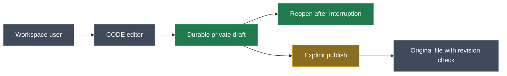

# Drafts and safe Office upgrades

**Status:** Future plan. The working local Office MVP remains the baseline. This document does not change its save behavior, enable a deployment, or claim that drafts or blue/green upgrades already work.

## Why do this later?

The MVP already opens real Verentis documents in Calc, Writer and Impress. Preserve that experience for the sprint preview. The next problem is different: a CODE pod holds an open editor in memory, and replacing or losing that pod can discard edits not durably saved. Keeping a second pod running does not copy the first pod's document state. A weekend-long old pod is not a viable recovery policy.

<Callout id="mvp-boundary" tone="warning" title="Do not reframe the current MVP as draft-first">

The current live WOPI `PutFile` path writes the original through a conditional platform save. CODE may initiate saves independently of the wrapper's Save action. A draft design must change the target of those writes, not merely rename an existing save or imply the current editor never writes automatically.

</Callout>

## 1. Prove the editor boundary before choosing an implementation

Using the pinned CODE image and an isolated workbook, edit without pressing Save. Record exactly when CODE sends `PutFile`, which bytes it sends, and whether a supported Save As/export operation can capture the **current unsaved editor state** without first updating the original. Test save, autosave, disconnect and pod loss. Download and hash the original independently after every scenario.

**Decision gate:** If a copy operation cannot guarantee an unchanged original, do not build recovery around it. Prefer opening a separate draft as CODE's WOPI source from the outset. A Save As implementation is an optimization only after its actual behavior is proven with this image and our WOPI host; it is not an assumed CODE feature.

<Callout id="crash-boundary" tone="warning" title="A shutdown message is not a backup">

A node can fail without warning, or a browser can be offline. A mechanism invoked only during deployment cannot save the latest in-memory edit. Recovery can promise only the **last confirmed durable draft checkpoint**, and the UI must show that boundary honestly.

</Callout>

## 2. Add durable, private drafts

Create one draft identity bound to account, workspace, branch, file, user and installation. CODE's WOPI source points to that draft; edits and CODE autosaves update the draft, **never the original**. Store recoverable draft bytes, revision, original base revision, timestamp and save receipt durably, with access checks, retention, encryption-at-rest policy and cleanup. Reopening after expiry requires fresh Verentis authorization; possession of an old URL or token is insufficient.

Provide an explicit **Save to original** action. Compare the draft's base revision with the original's current revision and perform a conditional platform write. On conflict, retain the draft and offer reconciliation; never force-write or silently promote it. Only a matching durable receipt may show “Saved to original.” Provide **Discard draft** as a separate confirmed action.

The first implementation should prove a real Calc edit persists to the draft, survives backend and CODE restarts, and reopens without altering the original. Then test Writer/Impress and the registered view-only formats before claiming their behavior. A backup-named file in the workspace is not the default: that changes file listing, permissions and lifecycle without solving draft ownership.

## 3. Make recovery visible to the user

Show **Draft saved at [time]**, **Saving draft**, **Unverified edits**, **Save to original** and **Original changed elsewhere** as distinct states. Reopen the last confirmed draft after a disconnect or crash with a clear warning that later unsaved keystrokes may be lost. Never clear a dirty warning on a CODE acknowledgement alone.

For a planned upgrade, show **New editor version available** with **Keep editing** and **Switch when ready**. A switch first confirms a durable draft checkpoint (or, only if the user chooses it, a confirmed save to original), then opens a fresh session on the new CODE version. A timeout, conflict, expired authority or missing receipt keeps the old session open where possible and explains the recovery path; it is not a successful switch.

<Callout id="unattended-user" tone="warning" title="Unattended and expired sessions">

A user who leaves on Friday cannot click a banner. Do not keep an old CODE pod alive indefinitely or interpret an expired delegation as proof the document was saved. Retain the last authorized, durable draft according to an explicit retention policy; ask the returning user to authenticate again before recovery. Any unsaved edits after the last checkpoint remain unrecoverable if the old pod is lost.

</Callout>

## 4. Add bounded blue/green rollout before production

Keep old and new CODE versions on distinct services/routes. Direct **new** sessions to the new version; keep each **existing** browser/WebSocket session pinned to its old version. Stop old admissions, surface the switch notification, and observe active sessions, durable draft checkpoints, pending writes and locks. Retire the old version after an explicit maximum drain period and recovery policy, not an unbounded weekend wait.

The wrapper can be rolled separately. The WOPI backend's current SQLite state has a **single-writer** constraint: do not put two backend versions on the same database. Plan its handover or a storage/coordination redesign before claiming an end-to-end simultaneous old/new stack. Blue/green is for planned changes; a node failure can still kill an active CODE session, leaving recovery at the last durable draft checkpoint.

<Callout id="sprint-tradeoff" tone="warning" title="Accepted sprint limitation">

Sprint currently deploys on push without blue/green or automatic session draining. A CODE digest or pod-configuration change, or a node failure, may interrupt active edits. Its pinned digest does not change just because Collabora publishes a new tag, but pinning cannot prevent infrastructure failures. Do not present sprint rollout behavior as production-grade continuity.

</Callout>

## Sequence and effort for an AI-assisted implementation

| Stage | Exit evidence | Rough effort |
| --- | --- | --- |
| CODE behavior spike | Original hash unchanged while a distinct copy/draft contains the exact edited bytes; failure scenarios recorded | One focused session |
| Draft-first end-to-end slice | Authorized Calc draft, conditional publish, conflict retention, restart and fresh reopen proven | Several focused sessions |
| Recovery and format hardening | Honest status UI, expiry/revocation, retention and cleanup, Writer/Impress and cross-session tests | Further iterative sessions |
| Blue/green for production | Version-bound routing, bounded drain, rollback and backend handover tested with live sessions | Separate production-readiness project |

These are investigation and delivery stages, not calendar promises. If CODE cannot provide a supported way to checkpoint live edits without writing the original, the draft-first WOPI source is required and the scope grows. No stage is complete merely because CODE reports “saved”: independently verify bytes, revisions and a fresh reopen.

**Near-term order:** finish dynamic parent-origin validation and the sprint deployment prerequisites; retain the current MVP's working open/render behavior. Start the CODE behavior spike when draft recovery becomes the next approved goal. Do not quietly change save semantics as part of the sprint deployment.
